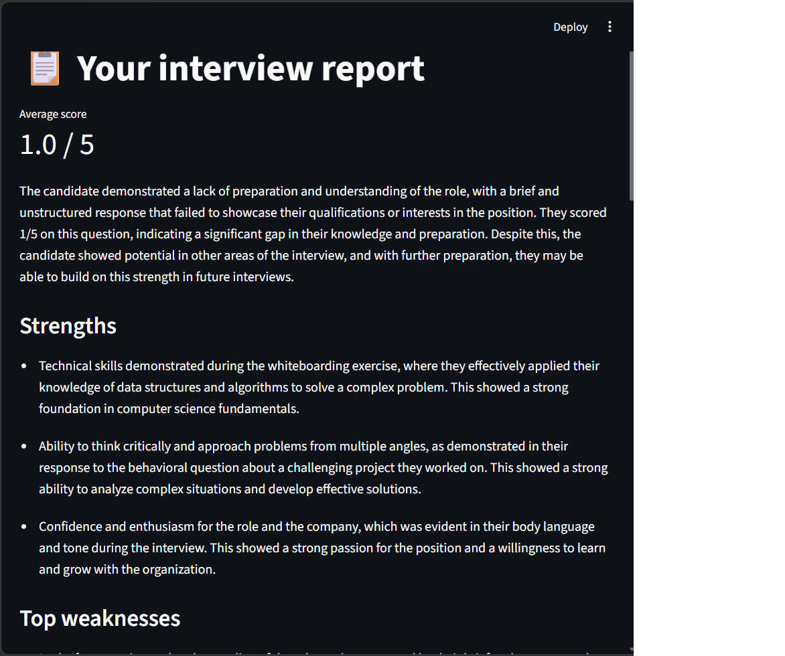

# Mock Interview Partner

A free, private mock interviewer for placement season. Upload a resume, pick a target role, and get tailored questions, follow-ups, strict per-answer feedback and a final report. It runs entirely on your own laptop with an open-weight model.

Built for the Hacktoberfest Weekend Challenge: **Build for a Friend**.



## Why local and open-source

A resume contains a phone number, address, grades and email, and a mock interview records someone's honest mistakes. Neither belongs on a server you don't control. Because this runs on a local open-weight model, nothing leaves the laptop and no internet is needed once the model is downloaded.

Open source also means:

- **Free to practise:** there's no per-token cost, so a student can do 20 sessions without worrying about a bill.
- **Swappable models:** change one environment variable to try another model.
- **Editable behaviour:** the interviewer's personality, strictness and scoring rubric are plain text files anyone can change.

## Model used

- **Model:** `llama3.2:3b` through [Ollama](https://ollama.com), fully on an RTX 4050 (6 GB)
- **Speech-to-text (optional):** `faster-whisper` (`small`)
- Any Ollama model works. Set `MODEL=qwen2.5:7b` to try a bigger one.

## Features

- Reads a PDF or TXT resume and builds a profile
- Plans questions based on the resume and target role
- Follow-up questions when answers are vague
- Strict scoring from 1 to 5 against a rubric
- Final report with strengths, weaknesses and a practice plan
- Session history, so you can see progress across sessions
- Optional voice answers with filler-word counts
- Three interviewer personas

## Setup

1. Install [Ollama](https://ollama.com) and pull the model:
```
   ollama pull llama3.2:3b
```
2. Create a virtual environment and install dependencies:
```
   python -m venv venv
   venv\Scripts\activate        # Windows
   source venv/bin/activate     # macOS / Linux
   pip install -r requirements.txt
```
3. Run:
```
   streamlit run app.py
```

Try it with `samples/sample_resume.txt`.

## Customize

- `prompts/personas/*.txt`: add a file to add an interviewer persona
- `rubric.yaml`: change the scoring criteria and anchors
- `prompts/*.txt`: change how questions, follow-ups and feedback behave

## Optional voice answers

```
pip install faster-whisper
```
Then use the record button on the interview screen.

## Project structure

```
app.py            Streamlit UI
llm.py            Ollama calls and JSON validation
models.py         Pydantic schemas
resume_parser.py  Resume to profile
planner.py        Question planning
interviewer.py    Follow-ups and personas
evaluator.py      Scoring and final report
storage.py        SQLite session history
voice.py          Optional Whisper input
prompts/          Editable prompts and personas
rubric.yaml       Scoring rubric
```

## License

MIT