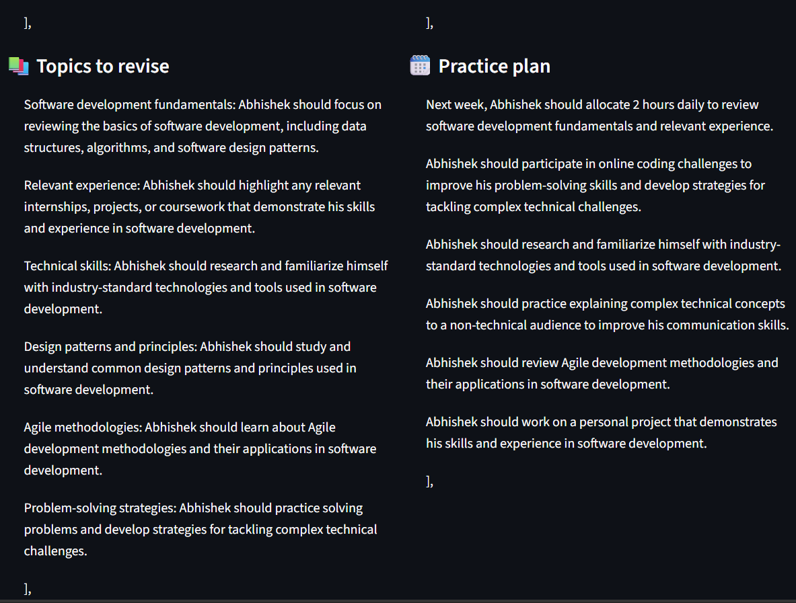

# 🎤 Mock Interview Partner

A free, private mock interviewer for placement season. Upload a resume, choose a target role, and get tailored questions, follow-ups, strict per-answer feedback and a final report. It runs entirely on your own laptop with an open-weight model, so nothing is sent to a server.

Built for the Hacktoberfest Weekend Challenge: **Build for a Friend**.


## Why local and open-source

A resume contains a phone number, address, grades and email, and a mock interview records someone's honest mistakes. Neither belongs on a server you don't control. Running a local open-weight model means nothing leaves the laptop, and no internet is needed once the model is downloaded.

Open source also gives you:

- **Free practice:** no per-token cost, so a student can do 20 sessions without worrying about a bill.
- **Swappable models:** pick any model you have pulled in Ollama from the sidebar dropdown.
- **Editable behaviour:** the interviewer's personality, strictness and scoring rubric are plain text files anyone can change.

## Model used

- **Language model:** `llama3.2:3b` through [Ollama](https://ollama.com), running fully on an RTX 4050 (6 GB VRAM)
- **Speech-to-text (optional):** `faster-whisper` (`small`)
- Any Ollama model works. For example, set `MODEL=qwen2.5:7b` or choose it in the sidebar.

## Features

- Reads a PDF or TXT resume and builds a profile of skills, projects and experience
- Plans questions around the resume and the target role
- Sidebar controls for model, interviewer persona, interview focus, candidate level and number of questions
- Follow-up questions when an answer is vague
- Strict 1 to 5 scoring against an editable rubric
- On-demand stronger sample answers built only from the candidate's own resume facts
- Final report with strengths, weaknesses, topics to revise and a practice plan
- Session history, so progress across sessions is visible
- Optional voice answers, with word and filler-word counts
- Downloadable report as Markdown

## Screenshots

### Final report: summary


### Final report: question review



## Setup

1. Install [Ollama](https://ollama.com) and pull the model:
   ```
   ollama pull llama3.2:3b
   ```
2. Create a virtual environment and install the dependencies:
   ```
   python -m venv venv
   venv\Scripts\activate        # Windows
   source venv/bin/activate     # macOS / Linux
   pip install -r requirements.txt
   ```
3. Start the app:
   ```
   streamlit run app.py
   ```

Try it with `samples/sample_resume.txt`, a fake resume included in the repo.

## Customize

- `prompts/personas/*.txt`: add a file to add a new interviewer persona
- `rubric.yaml`: change the scoring criteria and score anchors
- `prompts/*.txt`: change how questions, follow-ups and feedback behave
- `.streamlit/config.toml`: change the theme colours

## Optional voice answers

```
pip install faster-whisper
```
Then open "Answer by voice" on the interview screen. The first use downloads the Whisper model once.

## How it works

```
Resume (PDF/TXT)
  → text extraction (pdfplumber)
  → local LLM via Ollama: structured profile
  → question plan (role, focus, level, persona)
  → interview loop: answer → score + feedback → optional follow-up
  → final report + session history (SQLite)
```

## Project structure

```
app.py            Streamlit dashboard
llm.py            Ollama calls and JSON validation
models.py         Pydantic schemas
resume_parser.py  Resume to profile
planner.py        Question planning
interviewer.py    Follow-ups and personas
evaluator.py      Scoring, sample answers and final report
storage.py        SQLite session history
voice.py          Optional Whisper input
prompts/          Editable prompts and personas
rubric.yaml       Scoring rubric
docs/             README screenshots
```

## Privacy

Everything runs locally. Interview history is stored in a local `sessions.db` file, which is excluded from Git. Don't commit real resumes.

## License

MIT